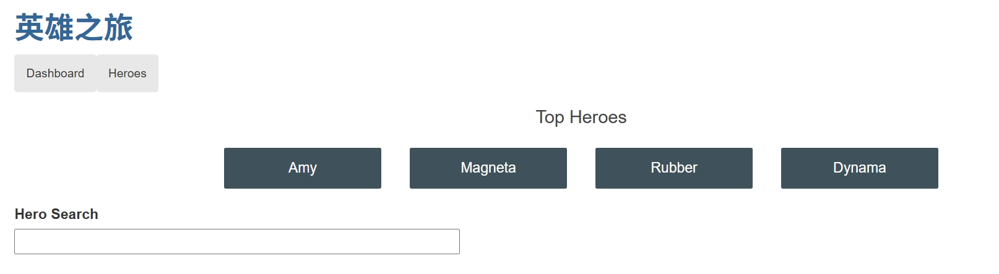
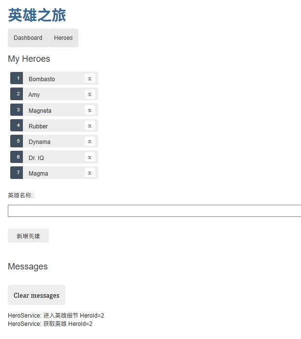
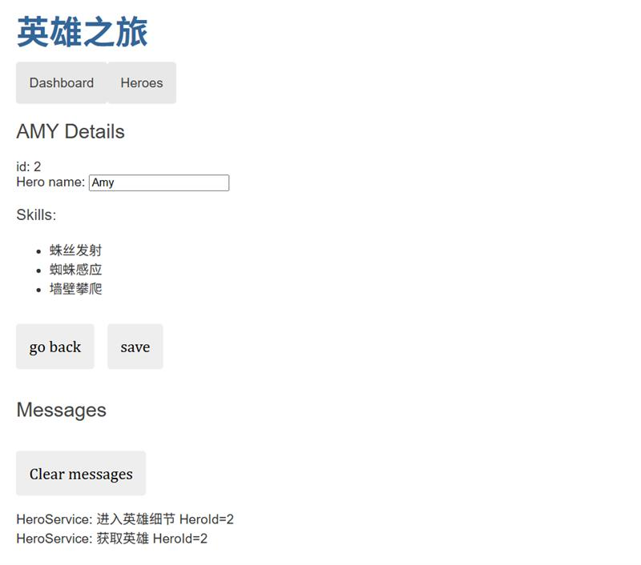

# AngularTourOfHeroes


## 一、简介
1. 这是一个基于Angular和C#构建的前后端分离入门小项目，<mark>仅供初学者练手</mark>
   > 也许后续会优化（
2. 前端部分包含：
   - 功能组件
   - 注入服务
   - 重定向路由

[angular17官方参考文档](https://v17.angular.io/guide/developer-guide-overview)

**页面展示：**
> 导航


> 展示所有角色


> 角色细节




| 前端地址| 后端地址|
|-|-|
|[jzr778/angular-tour-of-heroes](https://github.com/jzr778/angular-tour-of-heroes) | [jzr778/TourOfHeroes](https://github.com/jzr778/TourOfHeroes) |

## 二、 启动项目
#### 快速开始
1. 克隆仓库
    ``` bash
    git clone https://github.com/jzr778/angular-tour-of-heroes.git
    cd angular-tour-of-heroes
    ```
2. 安装依赖
   ``` bash
   npm install
   ```
3. 启动项目
   ``` bash
   ng serve
   ```
在浏览器中访问`http://localhost:4200/`即可

**注意**：需要同时启动[后端项目](https://github.com/jzr778/TourOfHeroes)

#### 脚手架

运行 `ng generate component component-name` 来生成一个新的组件。你也可以使用 `ng generate directive|pipe|service|class|guard|interface|enum|module` 来生成其他类型的Angular项目元素。

#### 构建

运行 `ng build` 来构建项目。构建生成的文件将被存储在 `dist/` 目录中。

#### Running unit tests

Run `ng test` to execute the unit tests via [Karma](https://karma-runner.github.io).

#### Running end-to-end tests

Run `ng e2e` to execute the end-to-end tests via a platform of your choice. To use this command, you need to first add a package that implements end-to-end testing capabilities.

#### Further help

To get more help on the Angular CLI use `ng help` or go check out the [Angular CLI Overview and Command Reference](https://angular.io/cli) page.
